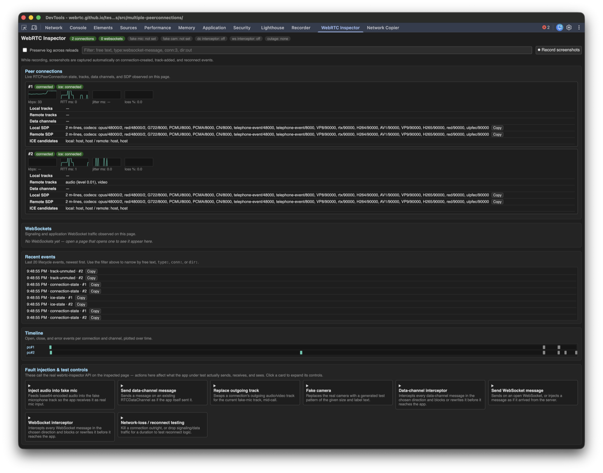

# webrtc-inspector

[](https://github.com/zoharbabin/webrtc-inspector/actions/workflows/ci.yml)
[](https://github.com/zoharbabin/webrtc-inspector/actions/workflows/livekit-nightly.yml)
[](https://www.npmjs.com/package/@zoharbabin/webrtc-inspector)
[](https://chromewebstore.google.com/detail/webrtc-inspector/mkfhlnakkjdmoofccmabhmnplmlglngb)
[](https://chromewebstore.google.com/detail/webrtc-inspector/mkfhlnakkjdmoofccmabhmnplmlglngb)
[](LICENSE)

See what's really happening inside any WebRTC call, on any page, with any SDK, no app changes needed.

It patches standard browser globals — `RTCPeerConnection`, `WebSocket`, `fetch`, `getUserMedia`, and more — before the page's own code can grab a reference. That gives you a live view of every connection, track, data channel, and signaling message, plus real fault injection to test reconnect logic.

Use it as a Chrome extension, an MCP server for AI coding agents, an npm library, or a Playwright plugin. Pick whichever fits how you work — they all share the same core.



## Quick start

Three pieces. Install just the one you need:

**1. Chrome extension** — for a human watching DevTools.

1. [Install from the Chrome Web Store](https://chromewebstore.google.com/detail/webrtc-inspector/mkfhlnakkjdmoofccmabhmnplmlglngb) — one click, no unzip needed.
2. Open DevTools on any page with a WebRTC session.
3. Click the "WebRTC Inspector" panel.

Building from source instead? Download the zip from the [latest release](https://github.com/zoharbabin/webrtc-inspector/releases/latest), unzip, then `chrome://extensions` → Developer mode → Load unpacked → that folder.

**2. MCP server** — for an AI agent (Claude Code, etc.), zero manual browser setup:

```sh
claude mcp add webrtc-inspector -- npx -y --package=@zoharbabin/webrtc-inspector webrtc-inspector-mcp
```

Call `wrtc_status` first. If nothing's reachable yet, it self-launches its own Chromium — no human needs to start Chrome. Full details: [MCP server](#mcp-server).

**3. Claude Code Skill** — recipes on top of the MCP tools (reconnect testing, quality regression triage, signaling-outage testing). Already there if you're working in a clone of this repo. In an npm-installed project, copy it in once:

```sh
mkdir -p .claude/skills/webrtc-inspector
cp node_modules/@zoharbabin/webrtc-inspector/.claude/skills/webrtc-inspector/SKILL.md .claude/skills/webrtc-inspector/
```

Need Playwright or a one-off console paste instead? See the full method comparison in [Usage](#usage).

### Try it: have Claude QA a live WebRTC call, hands-off

With the MCP server and Skill installed above, Claude can run an end-to-end debugging session on its own, no human opening DevTools. It needs one more thing: a general-purpose browser-automation MCP (Playwright MCP, chrome-devtools-mcp, or similar) to click the page's own buttons. webrtc-inspector only inspects and fault-injects; it's not a page-automation tool. The two are complementary: one drives the page, the other watches the WebRTC layer underneath it.

**Point both MCPs at the same browser, or they'll watch nothing.** By default each one self-launches its own separate Chromium. Playwright clicks around in one, while webrtc-inspector's snapshot/stats tools sit idle on a different, empty browser that never saw the real session.

Give them one shared instance instead:

1. Launch Chrome yourself with `--remote-debugging-port=9222`.
2. Set `WRTC_CDP_ENDPOINT=http://localhost:9222` for webrtc-inspector.
3. Set the matching `--cdp-endpoint`/attach flag for the other MCP.

Same browser, same tab: one tool drives it, the other inspects it. Any webrtc-inspector tool call re-arms its instrumentation for new pages the other MCP opens, as long as webrtc-inspector's own MCP server stays connected for the session, which it does by default.

Point it at the public [pc1 sample](https://webrtc.github.io/samples/src/content/peerconnection/pc1/) and ask:

> Open https://webrtc.github.io/samples/src/content/peerconnection/pc1/, click Start then Call, check the connection's quality, then kill it and tell me whether it recovers.

What actually happens, no human involved:

1. `wrtc_status` — confirms a browser is reachable (self-launches one if not).
2. The browser-automation tool navigates to the page and clicks `#startButton`, then `#callButton` — the page's own two `RTCPeerConnection`s negotiate directly against each other, no signaling server involved.
3. `wrtc_get_snapshot()` — both connections show `state: 'connected'`, tracks flowing, a `qualityScore`. Claude notes the `id` of one connection.
4. `wrtc_kill_connection({ connId })` — a real `pc.close()`, simulating an abrupt network/tab death.
5. `wrtc_get_snapshot()` again — that connection now shows `state: 'closed'`. This demo has no reconnect logic, so it stays closed. That's a real, reportable finding, not a tooling gap.
6. Claude reports the result in plain language — what connected, what broke, what didn't recover.

Swap step 4 for `wrtc_restart_ice` (renegotiate without tearing down) or `wrtc_simulate_network_loss` (drop packets without killing the connection) to probe different recovery paths on your own app.

## What it patches

Every one of these is instrumented, so anything the page does through them shows up in the inspector automatically:

- `RTCPeerConnection` — tracks, transceivers, SDP, ICE, data channels
- `RTCDataChannel.send`
- `RTCRtpSender.replaceTrack`
- `MediaStreamTrack.stop` — patched directly. The spec doesn't fire `'ended'` for a self-initiated `stop()`.
- `WebSocket`
- `fetch` / `XMLHttpRequest` — covers HTTP-based signaling (WHIP/WHEP, SDP-over-HTTP). Previews land in `getSnapshot().httpRequests`. Faultable via `simulateNetworkLoss({targets: ['http']})`. Response previews are bounded on both paths: `fetch` samples a clone, capped at 8 KiB and 1.5s, and XHR keeps only the first 8 KiB of `responseText`. A large download never grows extension memory, and the app's own copy of the body is untouched either way. The time bound is `fetch`-only: there, a slow body or an open-ended content type (`text/event-stream`, `multipart/*`, NDJSON, gRPC) completes the record with headers and no preview instead of holding it open. XHR has no equivalent, because it only reports a body at `loadend` — an XHR that streams forever stays `pending` until the page goes away.
- `getUserMedia` / `getDisplayMedia`

It must run before the page's own scripts grab references to these globals — that's why it's a `document_start` patch, not a regular script.

The media path is not touched by default. `RTCConfiguration` is passed through unchanged, no encoded transform is attached, and no worker is started. So stats you read through the inspector are the stats the app would have without it, and the app is free to use `encodedInsertableStreams`/`createEncodedStreams()` or its own `sender.transform`. Only `setMediaFaultInjector` opts a connection into a transform, and only for connections created while it is armed (see [Media fault injection](#media-fault-injection)).

## Install

```sh
npm install @zoharbabin/webrtc-inspector
```

`main` resolves to `extension/core/webrtc-inspector.js`. Inside this repo, `core/webrtc-inspector.js` is a symlink to the same file, for repo-relative paths only.

## Usage

Full comparison — [Quick start](#quick-start) above covers the two most common paths (agent → MCP, human → extension); this is reference material for the rest.

| Method | When | How |
|---|---|---|
| Chrome extension | Interactive inspection | See [Quick start](#quick-start). From a clone instead of the release zip: `extension/` or `node_modules/@zoharbabin/webrtc-inspector/extension/`. |
| MCP server | MCP clients (Claude Code, etc.) | See [Quick start](#quick-start) and [MCP server](#mcp-server). |
| Playwright | Scripted tests | `await page.addInitScript({ path: require.resolve('@zoharbabin/webrtc-inspector') })` before `page.goto(url)`. Runs on every navigation. |
| DevTools console paste | One-off manual inspection | Paste `require.resolve('@zoharbabin/webrtc-inspector')`'s contents into the console before the connection is created. |

MCP-style Playwright tools that only expose post-navigation `browser_evaluate` miss anything created before that call — use the extension instead.

## DevTools panel

What you get once the panel is open, screenshot above:

- **Sparklines** — live bitrate/RTT/jitter/loss per connection, from each 1s `getSnapshot()` poll.
- **Copy buttons** — next to SDP, each data-channel/WebSocket message, and each log entry. Copies JSON to clipboard.
- **Timeline** — per-connection/-WebSocket open/close/error lifecycle, from the same log timestamps.
- **Theme sync** — matches DevTools' dark/light theme automatically.
- **Preserve log** — checkbox. Keeps connection/WebSocket/event history across page navigations. Buffers up to 5 page loads, tagged `page load #N` and dimmed.
- **Filter box** — narrows the log/connection/WebSocket lists live. Free text matches case-insensitively. `type:`, `conn:`, `dir:` tokens (e.g. `type:websocket-message conn:3 dir:out`) AND together.
- **Bad-state-first sort** — connections ranked failed → disconnected → closed → connecting/new → healthy. Ties keep insertion order. A connection ranks by whichever of `connectionState`/`iceConnectionState` is worse.
- **Screenshot capture** — "⏺ Record screenshots" button, off by default. While armed, it captures the tab on connection-created, track-added, or reconnect. Reconnect means ICE/connection state recovering to connected/completed after disconnected/failed. Each thumbnail is keyed to the triggering log entry's `seq` and shown inline — click to open full size. Requires the `tabs` permission and `host_permissions: ["<all_urls>"]`.
- **"Test this stream" overlay** — right-click any `<video>`/`<audio>` element → overlays live kind/status/quality on the element.
- **Per-site adapters** — `extension/adapters.js`: `{match(hostname, href), labeler?, decoders?}`, auto-selected by hostname. Add an entry to `ADAPTERS`, or set `window.__webrtcInspectorAdapters` to override the built-in list.

## API — `window.__webrtcInspector`

The full surface, whether you're calling it from the console, a Playwright script, or through the MCP tools below.

| Method | Does |
|---|---|
| `getSnapshot(opts?)` | Full state: connections, tracks, SDP/ICE summaries, data channels, WebSockets, HTTP requests, stats, flags, last 100 log entries. `activeOutages` lists the targets currently blocked by `simulateNetworkLoss`. JSON-serializable. `opts.detail: 'concise'` drops raw stats/log/message dumps, keeps derived metrics. Default: `'detailed'`. |
| `getSnapshotDiff(before, after)` | Delta between two `getSnapshot()` outputs: connections/WebSockets added/removed, and changed fields for the rest. |
| `exportBundle()` | `{exportedAt, version, snapshot, fullLog, statsHistory}` — full event log and full per-connection stats history, for bug reports. |
| `exportWebrtcInternalsDump()` | Same data as `exportBundle()`, reshaped to `chrome://webrtc-internals`' "Create Dump" format: `{UserAgent, getUserMedia, PeerConnections: {<id>: {url, rtcConfiguration, updateLog, stats}}}`. |
| `captureEvents()` / `diffCaptures(before, after)` | `captureEvents()` → `{capturedAt, events}`. `diffCaptures` compares two captures: `eventTypeCounts`, `sequenceLengths`, `firstDivergenceIndex` (`null` if identical or one is a prefix of the other). |
| `onEvent(fn)` | Subscribe to the live event log. |
| `getEvents({since?, limit?, maxChars?})` | Paginated log. `since` is a `seq` cursor (0 or omit = start). `maxChars` (default 25000) caps JSON size. Returns `{events, nextSince, remainingCount, truncated, truncationMarker}`. At least one entry is always returned when available. |
| `clearLog()` | Drop accumulated log/stats history. |
| `getSdp(connId)` | `{local, remote}` full SDP. |
| `getTrackDiagnostics(trackIds)` | Matches track ids (e.g. an element's `srcObject.getTracks()`) to a tracked local/remote track. Returns `{connectionId, kind, status, qualityScore, ...}`, `null` if no match. |
| `getRemoteTrackStream(connId, trackId)` | Live `MediaStream` for one remote track. |
| `replaceOutgoingTrack(connId, kind, track, trackId?)` | Swap a sender's outgoing track. `trackId` (from `getSnapshot()`'s `localTracks[].trackId`) picks which sender when a connection has more than one of `kind` (e.g. camera + screen-share); omitted, it targets whichever sender `getSenders()` returns first. |
| `capEncoding(connId, kind, {maxBitrate, maxFramerate, scaleResolutionDownBy, degradationPreference}, trackId?)` | Force encoding params via `getParameters()`/`setParameters()`. Omit a caps field to leave it. Same `trackId` disambiguation as `replaceOutgoingTrack`. |
| `setFakeMic(base64\|ArrayBuffer)` / `clearFakeMic()` | Route future `getUserMedia({audio:true})` to a synthetic source / restore real mic. |
| `injectAudio(base64\|ArrayBuffer)` | `setFakeMic` + play immediately. |
| `playIntoFakeMic()` | Replay the armed fake-mic buffer. |
| `getFakeMicTrack()` | Fresh cloned track from the fake-mic source. |
| `setFakeCam({width,height,color,text,fps})` / `clearFakeCam()` | Synthetic canvas video source / restore real camera. |
| `injectDataChannelMessage(connId, label, data)` | Deliver a message as if the remote peer sent it. |
| `setDataChannelInterceptor(fn)` / `clearDataChannelInterceptor()` | `fn(dir, {connId, label, data})` on every send/deliver. Return new data to rewrite, `false` to block, nothing to pass through. |
| `registerDecoder(matcher, decodeFn)` | `matcher(meta) -> boolean`, `meta = {kind, connectionId?, socketId?, label?, url?, dir}`. First match wins. `decodeFn(normalizedData, meta) -> any\|Promise`. Runs after any interceptor. |
| `setSuggestDecoder(fn)` / `clearSuggestDecoder()` | Runs only when no `registerDecoder` matched. Result lands under `suggested` (never `decoded`) with `advisory: true`. This library makes no LLM calls itself. |
| `setLabeler(fn)` / `clearLabeler()` | `fn(meta) -> string\|null`, `meta = {kind:'connection', connectionId, urls}` or `{kind:'websocket', socketId, url}`. Result lands in `label` (`null` if unmatched, or if `fn` throws). |
| `setIceCandidateFilter(connId, fn)` / `clearIceCandidateFilter(connId)` | `fn(candidateType, candidateStr) -> boolean`, `false` drops. Scoped per connection. A throwing `fn` lets the candidate through. |
| `setWebSocketInterceptor(fn)` / `clearWebSocketInterceptor()` | `fn(dir, {socketId, url, data})`, same return contract as the data-channel interceptor. |
| `injectWebSocketMessage(socketId, data)` | Synthetic incoming message, no real network. |
| `sendOnWebSocket(socketId, data)` | Real `send()` on a tracked socket. |
| `killConnection(connId)` | Real `pc.close()` — abrupt transport death. |
| `restartIce(connId)` | Real `pc.restartIce()` — renegotiate in place, no teardown. |
| `simulateNetworkLoss(durationMs, {targets})` | Drops sends on `websocket`/`datachannel` (default both) for `durationMs`, then restores. `'http'` also fails every `fetch`/XHR. `'media'` blacks out every live sender with `replaceTrack(null)` and gives the track back on restore: works mid-call on any connection, all engines, no renegotiation. Firefox still sends about one RTP packet per second on a track-less sender; Chromium and WebKit send none. Returns `{stop, done}`. Overlapping calls nest per target: the last one to end lifts the block, and `stop()` is idempotent. |
| `simulateNetworkPreset(name)` / `registerNetworkPreset(name, config)` | Named scenarios on `simulateNetworkLoss`. Ships `'home-wifi'`, `'4g-train'`, `'congested-mobile'`. `config = {durationMs, targets, pattern:'full'\|'flapping', flapIntervalMs?}`. Returns `{stop, done}`. |
| `setMediaFaultInjector(connId, kind, fn)` / `clearMediaFaultInjector()` | Per-frame fault injection through the standard WebRTC Encoded Transform (`RTCRtpScriptTransform`). `kind: 'audio'\|'video'`, `null` matches all. `fn(direction, frame, meta, report)` runs in a worker. Mutate `frame.data` to corrupt; return `false` to drop, `{delayMs}` to delay/reorder. One injector at a time. Details below. |

Every track from patched `getUserMedia`/`getDisplayMedia` is tagged (`fake-mic`/`real-device`/`display-capture`/`fake-cam`), visible in `getSnapshot()`.

Everything the inspector retains is capped, so a long-lived page or a reconnect loop can't grow it without bound: 5000 log entries, 60 stats samples per connection, 200 HTTP records, 100 WebSocket records. Socket eviction drops closed records oldest-first and never a live one, so a socket id stays addressable for as long as that socket is open.

#### Media fault injection

`setMediaFaultInjector` uses `RTCRtpScriptTransform` (Chrome 141+, Firefox 117+, Safari 15.4+), not Chromium's legacy `createEncodedStreams()`. It throws on arm where the API is missing, so feature-detect with `typeof window.RTCRtpScriptTransform === 'function'` rather than by browser name: Playwright's Linux WebKit build has no `RTCRtpScriptTransform` even though the same Playwright WebKit on macOS does. Rules that follow from how browsers implement it:

- **Arm it before the connection is created.** Chromium only accepts a sender transform before `setLocalDescription` and a receiver transform inside the `track` event, and clearing a live transform stalls media. So coverage is decided when a `RTCPeerConnection` is constructed and never removed. `getSnapshot().connections[i].mediaFaultInjectable` tells you which connections are eligible, and `mediaFaultCoveredEndpoints` how many sender or receiver endpoints actually carry the transform right now. `0` on an eligible connection means no fault can reach the media path. Each endpoint that takes the transform emits a `media-transform-installed` event (`connectionId`, `kind`, `direction`); one that can't emits `media-transform-failed` with the reason. Arming while uncovered connections are open emits a `media-fault-injector-uncovered` event with their ids.
- **Change or clear the fn any time on a covered connection.** `setMediaFaultInjector` again swaps the fn mid-call; `clearMediaFaultInjector()` switches the transform to pass-through. No renegotiation either way.
- **`fn` must be self-contained.** It is shipped as source text to the worker, so it can't close over page variables. Use the worker global `self` for state. Non-expression sources (method shorthand, bound or native functions) throw on arm.
- **Report back with `report(payload)`.** The 4th argument posts any structured-cloneable payload to the page as a `media-fault-report` event (`connectionId`, `kind`, `direction`, `trackId`, `payload`) via `onEvent`/`getEvents`. A throwing fn passes the frame through and emits one `media-fault-injector-error` per endpoint.
- **Connections the app configures with `encodedInsertableStreams: true` are never covered.** In Chromium the legacy API and `.transform` feed the same frame slot, and the later one silently starves the earlier, so the inspector stays off those connections. An endpoint that already carries an app `.transform` is skipped too (`media-transform-failed`), and if the app sets `.transform` later, the app's replaces the inspector's.
- **There is no duplicate-frame action, because the platform can't do one.** Enqueueing a second copy of an encoded frame succeeds in the worker on all three engines and produces zero extra RTP: measured `packetsSent` over a fixed window was identical to baseline on Chromium, Firefox and WebKit, with the copy's `rtpTimestamp` shifted by 0, +1 and +3000 and its `frameId` bumped. The sender drops the extra frame before packetization. To model duplicate RTP you need a proxy or a network shaper, not an encoded transform.
- **`{delayMs}` on a subset of frames can wedge the receiver.** Delaying *every* frame by the same amount just shifts the stream and stalls nothing. Delaying only some frames reorders them, and on Chromium and Firefox that builds a receive backlog that did not recover within 6s of measurement: with every 10th frame delayed, Chromium held `framesReceived` at 9 for ~2.7s and Firefox for ~4.8s while the sender's `framesEncoded` climbed linearly. WebKit was unaffected. Expect a reorder fault to look like a freeze, not like jitter.
- **A byte-flip corruption fault means three different things.** Same fn, same frames: Chromium stops decoding entirely (`framesDecoded` stuck at 0, `pliCount` climbing), Firefox decodes the garbage with no PLI at all, and WebKit's *sender* stops emitting packets while its encoder keeps running. Assert on "the stream broke", never on a specific counter, if your test runs on more than one engine.
- **CSP.** The worker is a `blob:` URL created from the page, so the page's `worker-src`/`script-src` must allow `blob:`. A blocked worker does not throw from the arm that created it, because it fails asynchronously: watch for a `media-fault-injector-error` with `stage: 'worker'`, or read `getSnapshot().mediaFaultWorkerError`. Once that is set the injector is disarmed and every later `setMediaFaultInjector` throws with the reason. **A connection created in the same tick as the arm is not protected by that**, because the worker's error arrives later: measured on a `worker-src 'self'` page, Chromium installed the transform both directions and then sent zero packets for the life of that connection (a silent total blackout), Firefox refused the transform and left media alone, WebKit installed it and kept sending anyway. On a page whose CSP you don't control, arm the injector and check `mediaFaultWorkerError` before you create the connection you care about.

### MCP server

`mcp/server.js` exposes the JSON-serializable API above as typed MCP tools (`wrtc_get_snapshot`, `wrtc_kill_connection`, `wrtc_restart_ice`, `wrtc_simulate_network_loss`, `wrtc_navigate`, `wrtc_status`, etc.).

Call `wrtc_status` first. It never throws. It returns `{cdpEndpoint, mode: 'attached'|'self-launched'|'disconnected', pageFound, pageUrl, inspectorLoaded, inspectorVersion}` even when nothing is connected yet — so an agent can check setup with no try/catch before calling anything else.

- **Attaches** to an already-running Chromium over CDP when `WRTC_CDP_ENDPOINT` (default `http://localhost:9222`) is reachable.
- **Self-launches** its own Chromium otherwise. No human needs to start Chrome first. `core/webrtc-inspector.js` is pre-injected via `addInitScript()` before any page script runs, same as the Playwright path. Headed by default — set `WRTC_HEADLESS=true` for CI or headless use.

```sh
# Attach mode
google-chrome --remote-debugging-port=9222   # or Chromium/Playwright-launched
WRTC_CDP_ENDPOINT=http://localhost:9222 node mcp/server.js   # defaults to that URL

# Self-launch mode: just run it, then call wrtc_navigate({url}) to open a page
node mcp/server.js
```

**Add it to an MCP client** — pick one:

```sh
# npm-installed
claude mcp add webrtc-inspector -- npx -y --package=@zoharbabin/webrtc-inspector webrtc-inspector-mcp

# repo clone
claude mcp add webrtc-inspector -- node /absolute/path/to/webrtc-inspector/mcp/server.js
```

Or the equivalent `.mcp.json`:

```json
{
  "mcpServers": {
    "webrtc-inspector": {
      "command": "npx",
      "args": ["-y", "--package=@zoharbabin/webrtc-inspector", "webrtc-inspector-mcp"]
    }
  }
}
```

`WRTC_CDP_ENDPOINT` is optional — only set it to attach to one specific already-running Chrome instead of letting the server self-launch its own:

```json
{
  "mcpServers": {
    "webrtc-inspector": {
      "command": "npx",
      "args": ["-y", "--package=@zoharbabin/webrtc-inspector", "webrtc-inspector-mcp"],
      "env": { "WRTC_CDP_ENDPOINT": "http://localhost:9222" }
    }
  }
}
```

First call after connecting: `wrtc_status` — confirms `mode` (`attached`/`self-launched`/`disconnected`) and whether a page is instrumented, before you rely on any other tool.

Covers the pure-JSON surface: snapshots/diffs/bundles/captures, `getSdp`, `killConnection`, `restartIce`, `simulateNetworkLoss`, `capEncoding`, fake mic/cam, and data-channel/WebSocket message injection. Also `wrtc_navigate({url})`, which points the current page at a target URL — creating and pre-instrumenting one if none exists yet.

`simulateNetworkLoss` blocks until the outage finishes. There's no early `stop()` across the MCP boundary.

Not exposed, since these take or return live JS references that can't cross the MCP boundary: `setMediaFaultInjector`, `setDataChannelInterceptor`, `setWebSocketInterceptor`, `registerDecoder`, `setSuggestDecoder`, `setLabeler`, `setIceCandidateFilter`, `onEvent`, `replaceOutgoingTrack`, `getFakeMicTrack`, `getRemoteTrackStream`.

Also not exposed, though it is pure JSON: `getEvents`. Use `wrtc_capture_events` for the log instead, or `core/webrtc-inspector.js` in-page for cursor-based pagination.

### Claude Code Skill

`.claude/skills/webrtc-inspector/SKILL.md` — reconnect-testing, quality-regression-triage, and signaling-outage recipes on top of the MCP tools above, auto-discovered by Claude Code from a project's `.claude/skills/` directory.

Works with no setup in a clone of this repo. In an npm-installed project, Claude Code doesn't scan `node_modules`, so copy the file in once:

```sh
mkdir -p .claude/skills/webrtc-inspector
cp node_modules/@zoharbabin/webrtc-inspector/.claude/skills/webrtc-inspector/SKILL.md .claude/skills/webrtc-inspector/
```

### `qualityScore` (1-5)

`getSnapshot().connections[].qualityScore` — single number, `null` when no data. Averages up to two sub-scores:

- **Audio** — simplified ITU-T G.107 E-model on RTT/jitter/loss. Ignores codec impairment and echo.
- **Video** — bits-delivered-per-pixel-per-frame, linearly mapped to 1-5. Ignores content complexity and codec efficiency.

Approximate diagnostic signal, not a certified MOS/VMAF measurement.

### `qualityFlag` (per remote track)

`getSnapshot().connections[].remoteTracks[].qualityFlag` — `'ok'`, `'degraded'`, or `'bad'`, based on that track's `freezeRatio`: `> 0.10` → `bad`, `> 0.01` → `degraded`, else `ok`. `null` until the track has a stats sample. More sensitive than the connection-level `freeze_ratio_bad` flag below (which only fires past 10%) — a track can show `degraded` while the connection's `flags` array stays empty. Check both when triaging quality, not just `flags`.

### Remote audio `level`

`getSnapshot().connections[].remoteTracks[].level` — 0-1 loudness from a Web Audio analyser on the remote track. Treat `0` and `null` differently: zero is measured silence, `null` is no measurement.

`levelUnavailableReason` is `'track-not-rendered'` when RTP is arriving but the browser is not decoding it, which happens because nothing in the page is rendering the track. Chromium only runs a remote track's audio decoder for a track something pulls, so the analyser would otherwise read pure silence and the inspector would report "the far end is silent" when the truth is "nothing is listening". In that state `level` is `null`, not `0`.

Attach the track to a sink and the level starts reading:

```js
const el = document.createElement('audio');
el.autoplay = true;
el.srcObject = new MediaStream([remoteTrack]);
document.body.appendChild(el);
```

Firefox and WebKit decode a remote audio track with no sink attached, so they report a real level either way. Detection is a stats delta (packets growing while `totalSamplesReceived` stays flat), so it needs two stats polls before the reason appears.

The other two reasons:

| `levelUnavailableReason` | Meaning |
| --- | --- |
| `'audio-context-not-rendering'` | The meter's `AudioContext` clock did not advance between ticks, so the analyser holds flat silence no matter what arrives. Usually the context is suspended pending the page's first user gesture; on a machine with no audio output device (a container, a CI runner) headless Firefox stays suspended for good. Detected by comparing `currentTime` rather than reading `state`, so a stopped clock and a context that stalls mid-call are both caught. The meter retries `resume()` (one attempt in flight at a time) and clears the reason as soon as the clock moves. |
| `'meter-failed'` | The analyser graph could not be built for this track at all. Paired with an `audio-meter-failed` event carrying the error. Never clears; the track has no meter for the life of the connection. |

Any other `null` level, with `levelUnavailableReason` also `null`, just means no sample yet.

### `flags`

`getSnapshot().connections[].flags` — short machine-readable strings, computed live. Empty when nothing looks wrong.

| Flag | Meaning |
|---|---|
| `ice_stuck_checking_<ms>ms` | ICE in `checking` for over 5s. |
| `datachannel_opened_never_used:<label>` | Channel `open` for over 3s, zero messages. |
| `track_added_no_stats:<trackId>` | Track added over 3s ago, no correlated stats report. |
| `freeze_ratio_bad:<trackId>` | Remote track `freezeRatio` above 10%. |
| `quality_limited_<reason>:<trackId>` | Local track `qualityLimitationReason` is non-`'none'`. |
| `candidate_type_flipped_<n>x` | Selected candidate type flipped (srflx↔relay) 2+ times. |

Every flag except `quality_limited_*` works on all three engines. Firefox does not report `qualityLimitationReason` on `outbound-rtp` at all, so on Firefox that flag never fires and `localTracks[].qualityLimitationReason` stays `null` even while the encoder is CPU- or bandwidth-limited. The freeze metrics behind `freeze_ratio_bad` and `qualityFlag` are reported by Chromium, Firefox and WebKit alike, so use those for cross-engine quality triage.

### Reconnect / fault-injection primitives

`browserContext.setOffline()` and DevTools' `Network.emulateNetworkConditions` don't touch already-flowing WebRTC UDP media. `pfctl`/`tc` is the OS-level fallback. `simulateNetworkLoss({targets: ['media']})` (mid-call outgoing blackout) and `setMediaFaultInjector` (per-frame, armed before the connection exists) are the page-JS alternatives.

| Primitive | Tests |
|---|---|
| `killConnection` | Fresh-session recovery after abrupt death. |
| `restartIce` | Renegotiate-in-place recovery, no teardown. |
| `simulateNetworkLoss` | Heartbeat/backoff detection of a control-plane outage. Pick `durationMs` past any known heartbeat interval. |
| `setMediaFaultInjector` | Concealment/jitter-buffer/PLI/NACK tolerance to real packet loss/reorder/duplication. |

### Scenario compiler

`extension/scenario-compiler.js` — optional, not loaded by default. Deterministic keyword/regex DSL (no LLM) compiling a scenario phrase into a sequence of the primitives above.

```js
const { compileScenario, runCompiledScenario } = require('@zoharbabin/webrtc-inspector/extension/scenario-compiler.js');

const compiled = compileScenario('drop packets for 3s then kill the connection', { connectionId: 1 });
// compiled.steps -> [
//   { primitive: 'simulateNetworkLoss', args: [3000, { targets: ['media'] }] },
//   { primitive: 'killConnection', args: [1] },
// ]
// compiled.warnings -> [] (unmapped clauses, or kill/restartIce with no connectionId)

await runCompiledScenario(compiled, window.__webrtcInspector, { bundle: true });
// attaches exportBundle() as `bundle`
```

Clauses split on `"then"`/`";"`. Matched in this priority order:

1. Named preset (`"home wifi"`/`"4g train"`/`"congested mobile"`) → `simulateNetworkPreset`
2. `"kill"`/`"terminate"` → `killConnection`
3. `"restart ice"` → `restartIce`
4. A duration (e.g. `"for 5s"`) → `simulateNetworkLoss`

For `simulateNetworkLoss`, `targets` is inferred from keywords: `data channel`, `websocket`/`signaling`, `http`/`whip`/`whep`, `media`/`audio`/`video`/`rtp`/`packet`. Default is `['websocket', 'datachannel']`.

### Signature matching

`extension/signature-matcher.js` — optional, not loaded by default. Pattern-matches a captured event log against named signatures.

```js
const { matchSignatures } = require('@zoharbabin/webrtc-inspector/extension/signature-matcher.js');

const capture = window.__webrtcInspector.captureEvents(); // or exportBundle()
const findings = matchSignatures(capture);
// [{ signature: 'missed-heartbeat-reconnect-gap', scopeKey: 'socketId', scopeId: 1,
//    missedCount: 3, firstMissedSeq: 12, closeSeq: 15, description: '...' }, ...]
```

`matchSignatures(capture, signatures?, opts?)` accepts a raw events array, `captureEvents()`-shaped `{events}`, or `exportBundle()`-shaped `{fullLog}`. Pass `signatures` to run custom ones alongside or instead of the defaults.

| Signature | Flags |
|---|---|
| `missed-heartbeat-reconnect-gap` | `opts.minConsecutive` (default 3) consecutive unanswered outgoing WebSocket/data-channel messages, then close within `opts.windowMs` (default 10000). |
| `abrupt-close-without-recovery` | `websocket-close`/`connection-killed`/failed-or-disconnected `connection-state` with no reconnect or same-connection recovery within `opts.windowMs`. |

### Metrics export

`extension/metrics-exporter.js` — optional, not loaded by default.

```js
const { startMetricsExporter } = require('@zoharbabin/webrtc-inspector/extension/metrics-exporter.js');
const handle = startMetricsExporter(window.__webrtcInspector, {
  endpointUrl: 'http://localhost:9090/api/v1/otlp/v1/metrics',
  format: 'otlp', // or 'prometheus' (default)
  intervalMs: 15000,
  resourceAttributes: { 'service.name': 'my-app' },
  onError: (err) => console.error('metrics push failed', err),
});
// later: handle.stop();
```

Pushes per-connection `qualityScore`, `bitrateKbps`, `rttMs`, `jitterMs`, `lossPct` as gauges. `connection_id` is the only label. Failed pushes route to `onError`, not thrown.

## Known limitations

Nothing here is hidden until it bites you:

- **`setMediaFaultInjector` covers only connections created while it is armed** — a browser constraint of `RTCRtpScriptTransform` (see [Media fault injection](#media-fault-injection)). For a mid-call media outage use `simulateNetworkLoss({targets: ['media']})`, which needs no transform.
- **Decoded payloads aren't redacted** — `registerDecoder` output is size-capped but not scrubbed. Redaction is the caller's responsibility.
- **SFU app-message channels** — some SFU transports route control-plane messages over `WebSocket` instead of `RTCDataChannel`. Covered here since `WebSocket` is patched.
- **Unpatched transports** — WebTransport, SSE, or a native channel carrying control-plane traffic is invisible.
- **Timing-dependent** — only sees connections/tracks/channels created after the patch runs.

## Roadmap

Tracked as issues: https://github.com/zoharbabin/webrtc-inspector/issues

Found a bug, or have an idea? Open an issue, bug reports and feature requests are both welcome.

## Testing

Want to change something? Here's the whole loop:

```sh
npm install
npx playwright install --with-deps chromium firefox webkit   # once
npm test                                      # headless run
npm run test:ui                               # interactive UI mode
npm run lint
npm run pack-extension                        # -> dist/webrtc-inspector-extension-v<version>.zip
```

Playwright suite under `test/specs/`, one file per feature area. Specs connect two `RTCPeerConnection`s directly in one page (no signaling server) via `test/fixtures/session-helpers.js`.

The suite runs on Chromium. The two media-path specs (`media-fault-injection.spec.js`, `network-fault.spec.js`) also run on Firefox and WebKit, since `setMediaFaultInjector` and the `'media'` outage target are engine-neutral. `npx playwright test --project=firefox --project=webkit` runs just those.

`test/specs/mcp-server.spec.js` launches a real Chromium with `--remote-debugging-port`. It spawns `mcp/server.js` as a subprocess over stdio, via the MCP SDK's `Client`, and drives a real loopback session through the MCP tools.

CI (`.github/workflows/ci.yml`) runs lint and the full suite on every push/PR. It posts a pass/fail table to the job summary, and uploads the HTML report — traces and failure screenshots — as an artifact.

Pushing a `v<version>` tag matching `package.json` triggers `.github/workflows/release.yml`. It packs `extension/` and attaches the zip to a GitHub Release.

## License

MIT — see [LICENSE](LICENSE).
